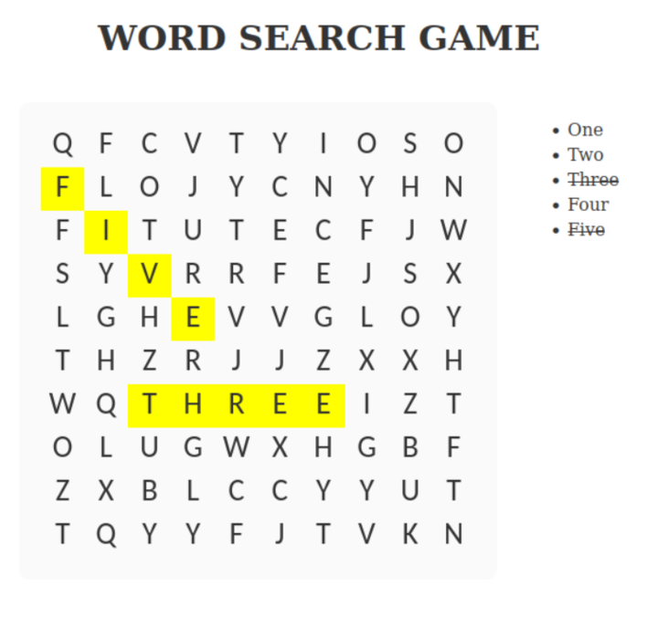

# Word Search

[//]: <> (Outline a brief description of your project.)
[//]: <> (Live demo [_here_](https://www.example.com). <!-- If you have the project hosted somewhere, include the link here. -->)

## Table of Contents
* [The Team 🤝](#TheTeam) 
* [What We're Creating 🧰](#WhatWe'reCreating) 
* [Technologies Used 🧑‍💻](#TechnologiesUsed) 
* [Who Are We Doing This For? 🫵](#WhoAreWeDoingThisFor?) 
* [Why Are We Doing This? 🤷](#WhyAreWeDoingThis?) 
* [Features 🎁](#Features) 
* [Screenshots 🖼](#Screenshots) 
* [Installation 🛠](#Installation) 
* [Usage 🧩](#Usage) 
* [Sprint 1 🏃](#Sprint1) 

## The Team 🤝

🥰`Ethan Reed`🥰

🐈`Melanie Garza`🐈

🏈`Cameron Chalupa`🏈

🙈`Cruz Lopez`🙈

😹`Zoe Becker`😹

## What We're Creating 🧰
We're creating a competitive word search web app.

## Technologies Used 🧑‍💻
- [PHP](https://www.php.net/) 
- [Python](https://www.python.org/) 
- [HTML](https://developer.mozilla.org/en-US/docs/Web/HTML) 
- [CSS](https://developer.mozilla.org/en-US/docs/Web/CSS) 
- [Javascript](https://developer.mozilla.org/en-US/docs/Web/JavaScript) 
- Forked from: https://github.com/joshbduncan/word-search-generator 

## Who Are We Doing This For? 🫵
We're doing this for casual fans of word searches who want a competitive experience.

## Why Are We Doing This? 🤷
We're doing this to bring people together in fun, safe, competitive environment.

## Features 🎁
List the ready features here:
- [Wordsearch - Give the user the ablitity to play wordsearch against a friend. 🧩](https://cs3398f23gorns1.atlassian.net/browse/SCRUM-10) 
- [Leader board- Keeps score and updates for solo or head-to-head play. 🥇🥈🥉](https://cs3398f23gorns1.atlassian.net/browse/SCRUM-6) 
- [Color theme customization- The ability to customize the themes on the webpage. 🧑‍🎨](https://cs3398f23gorns1.atlassian.net/browse/SCRUM-9) 
- [Word Themes - The ability to chose from different word search themes. 📚](https://cs3398f23gorns1.atlassian.net/browse/SCRUM-7) 
- [Play by Play updates ⚔](https://cs3398f23gorns1.atlassian.net/browse/SCRUM-8) 

## Screenshots 🖼

## Installation 🛠

Install Word-Search-Generator with pip:

$ pip install word-search-generator

## Usage 🧩

Just import the WordSearch class from the package, supply it with a list of words and you're set. 🧩

>>> from word_search_generator import WordSearch
>>> puzzle = WordSearch("dog, cat, pig, horse, donkey, turtle, goat, sheep")

## Sprint 1 🏃  (September 25 - October 6th)
